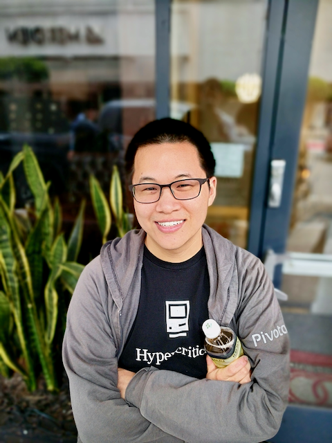

+++
title = "Hi there, I'm Jeff!"
disableShare = true
ShowReadingTime = false
+++

I'm a software engineer passionate about software engineering - which is the
never-ending challenge of balance of perfection and shipping.

In the past, I was a [consultant](https://pivotal.io/labs) working on iOS
applications using the C-family of languages and Swift. Clients ranged from
early stealth startups to Fortune 500 companies. In iOS, I'm probably best known
for work on [Nimble](https://github.com/quick/nimble) or
[Cedar](https://github.com/pivotal/cedar) or giving some talks in the early days
of Swift. Although, I've personally learned the most while making
[Hydrant](https://github.com/jeffh/Hydrant).

Before working on iOS, I've dabbled in teaching (programming) and various
dynamic languages (Python, Ruby, Perl, PHP, JavaScript, ActionScript/Flash,
etc.).

You can find me coding on [GitHub](https://github.com/jeffh), or occasionally
writing on [my blog](https://www.jeffhui.net/) here. The blog is mostly for
solidifying thoughts in the narrow-bandwidth of writing. Although, I also tend
to spend a lot of time doing deep work in various programming topics that may or
may not ever see the light of day.

After consulting, I worked in [Clojure](https://clojure.org), helping
[hair stylists sell hair extensions](https://welcome.mayvenn.com/stylists/welcome).
