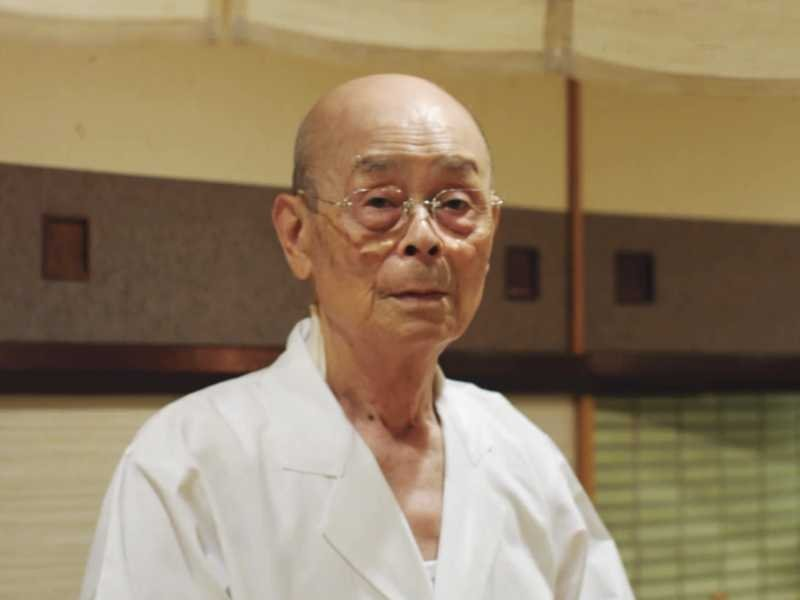

+++
title = 'Observation'
date = 2016-02-29
url = "2016/17-observation.html"
tags = ["Concepts"]
+++

The more you learn, the more this skill seems to be necessary. When missing a
bug or a refactor opportunity, I wonder how did I miss this? Sure, everyone
wants to learn from their mistakes. But noticing the little details gives you
the opportunity to adapt. Massive function definitions starts off looking like
an common pattern for code that needs to be refactored. Those dozen one-letter
variables names probably should be better named. Shadowing a variable is prone
to introduce errors in the future. All those mental notes form from being able
to observe it.

By observing, I mean decerning the signal from the noise of inputs. And it
doesn't have to apply to programming. How can you make your food taste better?
The video game, [Braid][braid], is a great example. It teaches players how its
rules of time manipulation lead to certain implications that are required to
solve puzzles.

Observation an interesting commonality among many skills. [Jiro][jiro] remarks
how he could be a better chef if only he had the tasting ability of Joel
Robuchon. Breaking a bad habbit first requires noticing that it's a bad habbit
in the first place. The first step to addiction is noticing (and admitting) you
have a problem. Great designers try to solve for the sutle details of human
interaction with the products they build.

Or another way of describing an expert: a person who has refined observation for
a specific skill. Someone that's a jack-of-all-trades is observant at seeing
similarities across multiple specialties. A researcher is looking for new
observations.

How do you become more observant? I'm not sure. There's a lot of little ways to
experience more:

- Meditation focuses on watching your breathing instead of wandering your mind.
- Hiking or climbing focuses on you physical movement.
- Drawing focuses on replicating details of the subject being drawn.
- Write in a journal (eg - food journal, finance journale).
- Taking up professional photography.
- Playing video games
- Standup Comedy
- Sports
- Etc.

They seems to have one thing in common: they all require noticing a sensory
experience. It's not just performing one of these activities, but getting
skilled at it makes you more observant.

[braid]: http://braid-game.com
[jiro]: http://www.magpictures.com/jirodreamsofsushi/
